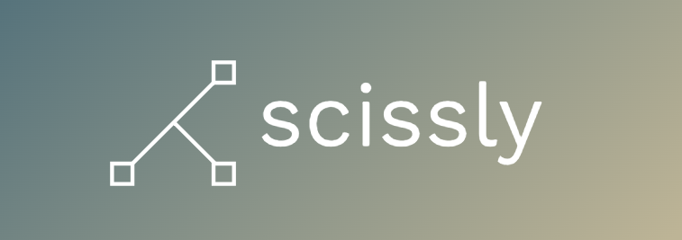

# scissor_API / Scissly

<!-- Back to Top Navigation Anchor -->
<a name="readme-top"></a>

<!-- Project Shields -->
<div align="center">

  [![Contributors][contributors-shield]][contributors-url]
  [![Forks][forks-shield]][forks-url]
  [![Stargazers][stars-shield]][stars-url]
  [![Issues][issues-shield]][issues-url]
  [![MIT License][license-shield]][license-url]
  [![LinkedIn][linkedin-shield]][linkedin-url]
</div>

<!-- Project Logo -->
<br />
<div align="center">
  <a href="https://scissor-api-lyit.onrender.com/">
    
  </a>
</div>

<br />

<div>
  <p align="center">
    <a href="https://github.com/ChrizDuma/scissorAPI/wiki"><strong>Explore the docs »</strong></a>
    <br />
    <br />
    <a href="https://scissor-api-lyit.onrender.com/">Live Site</a>
    ·
    <a href="#sample">View Demo</a>
    ·
    <a href="https://github.com/ChrizDuma/scissorAPI/issues">Report Bug</a>
    ·
    <a href="https://github.com/ChrizDuma/scissorAPI/issues">Request Feature</a>
  </p>
</div>

---

<!-- Table of Contents -->
<details>
  <summary>Table of Contents</summary>
  <ol>
    <li>
      <a href="#about-scissly">About Scissly</a>
      <ul>
        <li><a href="#built-with">Built With</a></li>
      </ul>
    </li>
    <li>
      <a href="#implimented-functionality">Implimented Functionality</a>
    </li>
    <li>
      <a href="#usage">Usage</a>
      <ul>
        <li><a href="#live-link">Live Link</a></li>
        <li>
          <a href="#localhost">Local Host</a>
          <ul>
            <li><a href="#prerequisites">Prerequisites</a></li>
            <li><a href="#installation">Installation</a></li>
          </ul>
        </li>
      </ul>
    </li>    
    <li><a href="#sample">Sample</a></li>
    <li><a href="#license">License</a></li>
    <li><a href="#contact">Contact</a></li>
    <li><a href="#acknowledgements">Acknowledgements</a></li>
  </ol>
  <p align="right"><a href="#readme-top">back to top</a></p>
</details>

---

<!-- About the Tool -->
## About Scissly

Scissly is a tool that takes valid urls and converts them into shortened versions whilst creating qr-codes for the shortened url links.

The app also records the number of visits a shortened link receives.

Note: This App is in continious development and more features as well as its frontend integration will be implimented in the upcoming versions.

This tool is a product built by <a href="https://www.github.com/ChrizDuma">chrisduma</a>, a Backend Engineer at <a href="https://altschoolafrica.com/schools/engineering">AltSchool Africa</a>.

Live Site: [scissly](https://scissor-api-lyit.onrender.com/)

Full Documentation: [Scissly Wiki](https://github.com/ChrizDuma/scissorAPI/wiki)

<p align="right"><a href="#readme-top">back to top</a></p>

### Built With:

![Python][python]
![Flask][flask]
![PostgresQL][postgresql]
![SQLite][sqlite]

<p align="right"><a href="#readme-top">back to top</a></p>

---
<!-- Lessons from the Project -->
## Implimented Functionality

These are the practices/functionalities implimented during the creation of this app at it's current stage:
* QR Code Generation
* Rate Limiting
* Caching
* Routing
* Debugging
* Documentation
* Internet Security
* Database Management
* User Authentication & Authorization

<p align="right"><a href="#readme-top">back to top</a></p>

---

<!-- Getting Started -->
## Usage

This tool can be accessed via the deployed site in the link below or a local copy can be attained through forking the repository of the project.

### Live Link

Deployed site: [scissly](https://scissor-api-lyit.onrender.com/) - hosted via [render](https://www.render.com) 

### Local Host

To get a local copy up and running, follow the steps below.

#### Prerequisites

Python3: [Get Python](https://www.python.org/downloads/)

#### Installation

1. Clone this repo
   ```sh
   git clone https://github.com/ChrizDuma/scissorAPI.git
   ```
2. Activate the virtual environment
   ```sh
   source scissor/bin/activate
   ```
3. Install project packages
   ```sh
   pip install -r requirements.txt
   ```
4. Export Flask App as the api's root directory
   ```sh
   export FLASK_APP=api/
   ```
5. Run Flask
   ```sh
   flask run
   ```
6. Open the link generated in the terminal on a browser  

<p align="right"><a href="#readme-top">back to top</a></p>

---

<!-- Sample Screenshot -->
## Sample

<br />

[![Shorten URL Screenshot][shorten_url-screenshot]](https://github.com/ChrizDuma/scissorAPI/blob/main/images/shorten_url.png)

<br/>

---

<br/>

[![QR-code Screenshot][qr-code-screenshot]](https://github.com/ChrizDuma/scissorAPI/blob/main/images/qr-code.png)

<br/>

---

<br/>

[![Redirect Screenshot][redirect-screenshot]](https://github.com/ChrizDuma/scissorAPI/blob/main/images/redirect%20to%20original%20url.png)

<br/>

<p align="right"><a href="#readme-top">back to top</a></p>

---

<!-- License -->
## License

Distributed under the MIT License. See <a href="https://github.com/ChrizDuma/scissorAPI/blob/main/LICENSE">LICENSE</a> for more information.

<p align="right"><a href="#readme-top">back to top</a></p>

---

<!-- Contact -->
## Contact

Chris Duma - [@chrisduma](https://www.linkedin.com/in/chrisduma) - chrisduma01@yahoo.com

Live Site: [scissly](https://scissor-api-lyit.onrender.com/)

Project Link: [Scissly Repository](https://github.com/ChrizDuma/scissorAPI)

Documentation: [Scissly Wiki](https://github.com/ChrizDuma/scissorAPI/wiki)

<p align="right"><a href="#readme-top">back to top</a></p>

---

<!-- Acknowledgements -->
## Acknowledgements

This project was made possible by:

* [AltSchool Africa School of Engineering](https://altschoolafrica.com/schools/engineering)
* [Caleb Emelike's Flask Lessons](https://github.com/CalebEmelike)
* [GitHub Student Pack](https://education.github.com/globalcampus/student)
* [NameCheap Logo Maker](https://www.namecheap.com/logo-maker/)

<p align="right"><a href="#readme-top">back to top</a></p>

---

<!-- Markdown Links & Images -->
[contributors-shield]: https://img.shields.io/github/contributors/ChrizDuma/scissorAPI.svg?style=for-the-badge
[contributors-url]: https://github.com/ChrizDuma/scissorAPI/graphs/contributors
[forks-shield]: https://img.shields.io/github/forks/ChrizDuma/scissorAPI.svg?style=for-the-badge
[forks-url]: https://github.com/ChrizDuma/scissorAPI/network/members
[stars-shield]: https://img.shields.io/github/stars/ChrizDuma/scissorAPI.svg?style=for-the-badge
[stars-url]: https://github.com/ChrizDuma/scissorAPI/stargazers
[issues-shield]: https://img.shields.io/github/issues/ChrizDuma/scissorAPI.svg?style=for-the-badge
[issues-url]: https://github.com/ChrizDuma/scissorAPI/issues
[license-shield]: https://img.shields.io/github/license/ChrizDuma/scissorAPI.svg?style=for-the-badge
[license-url]: https://github.com/ChrizDuma/scissorAPI/blob/main/LICENSE.txt
[linkedin-shield]: https://img.shields.io/badge/-@chrisduma-1ca0f1?style=for-the-badge&logo=linkedin&logoColor=white&link=https://linkedin.com/in/chrisduma/
[linkedin-url]: https://www.linkedin.com/in/chrisduma/
[qr-code-screenshot]: images/qr-code.png
[shorten_url-screenshot]: images/shorten_url.png
[redirect-screenshot]: images/redirect%20to%20original%20url.png
[python]: https://img.shields.io/badge/python-3670A0?style=for-the-badge&logo=python&logoColor=ffdd54
[flask]: https://img.shields.io/badge/flask-%23000.svg?style=for-the-badge&logo=flask&logoColor=white
[sqlite]: https://img.shields.io/badge/sqlite-%2307405e.svg?style=for-the-badge&logo=sqlite&logoColor=white
[postgresql]: https://img.shields.io/badge/PostgreSQL-316192?style=for-the-badge&logo=postgresql&logoColor=white
